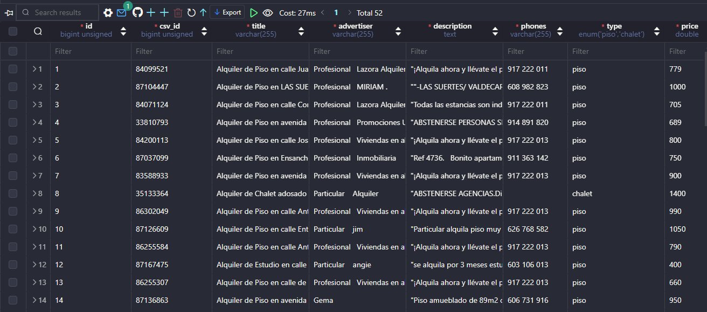
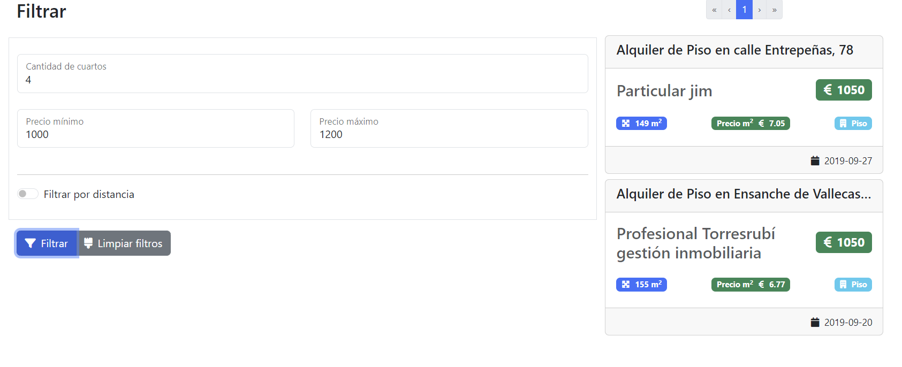
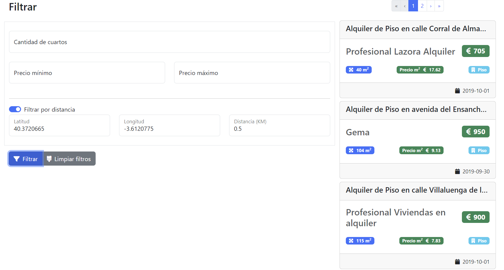

# Netforemost PHP Test

## Requirements

> PHP 8.3.9

> NODE 20.15.1

## Installation

### Backend

Inside on folder _./backend_ run the next command to install the dependecies for PHP:

```bash
composer install
```

> NOTE 1: I develop this app with docker using [Laravel Sail](https://laravel.com/docs/11.x/sail) to have an isolated environment.

> NOTE 2: If you are on Windows and want to use Laravel Sail you must have [WSL 2](https://learn.microsoft.com/en-us/windows/wsl/install) activated.

Run the next command to build the project with sails

```bash
./vendor/bin/sail up -d
```

Run migrations to insert data from CSV to the Database

```bash
./vendor/bin/sail artisan migrate:refresh --seed
```

### Frontend

Inside on folder _./frontend_ run the next command to install the dependecies for React:

```bash
yarn install
```

> NOTE 1: I'm using yarn but also works with npm

Run the application on develop mode with the next command:

```bash
yarn dev
```

## Completed Exercises

### Exercise 1

> Duration: 10 hours

For this exercise, I used Laravel migrations to read the CSV file and save it to the database. It was separated into 3 tables: "accommodations", "accommodations_details", and "accommodations_locations". The provided CSV had to be analyzed, and I realized it contained several errors, which required me to retest the methods for saving data to the database.



### Exercise 2

> Duration: 8 hours

For the following exercise, a GET route "/accommodations" was created to retrieve data from the database. Laravel controllers were used in the backend, along with a service and repository layer to separate queries from business logic. A React interface was created to allow users to filter data more easily.



### Exercise 3

> Duration: 6 hours

For the next exercise, I had to research how to calculate distance using coordinates. A formula was used in the query to process this data. On the frontend, we created a separate component for distance filters, and these were displayed on the screen.


